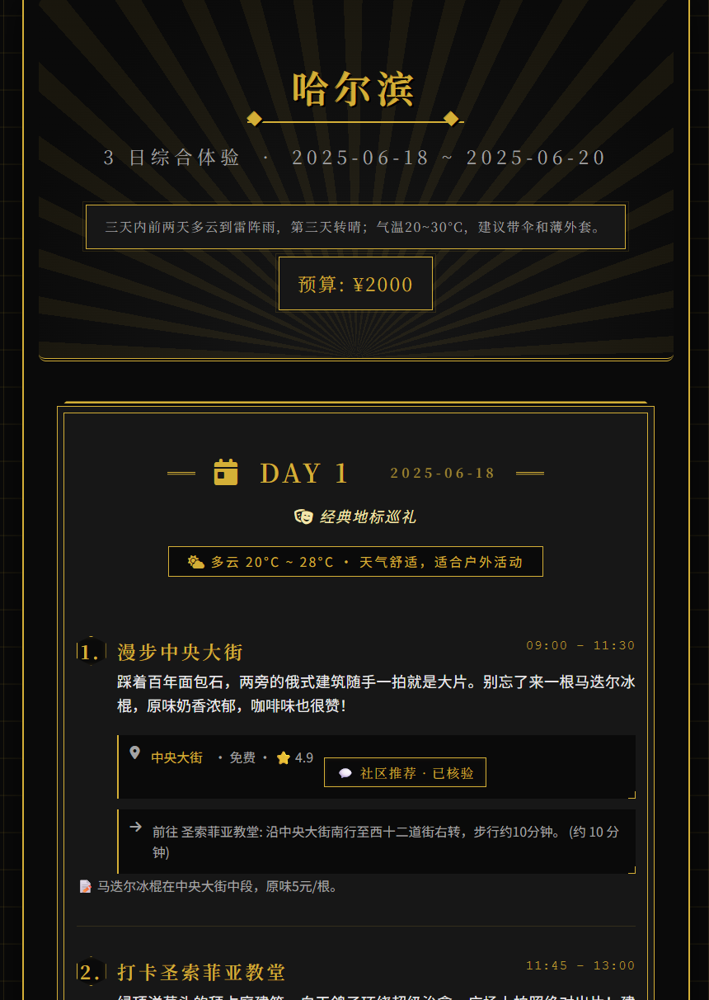
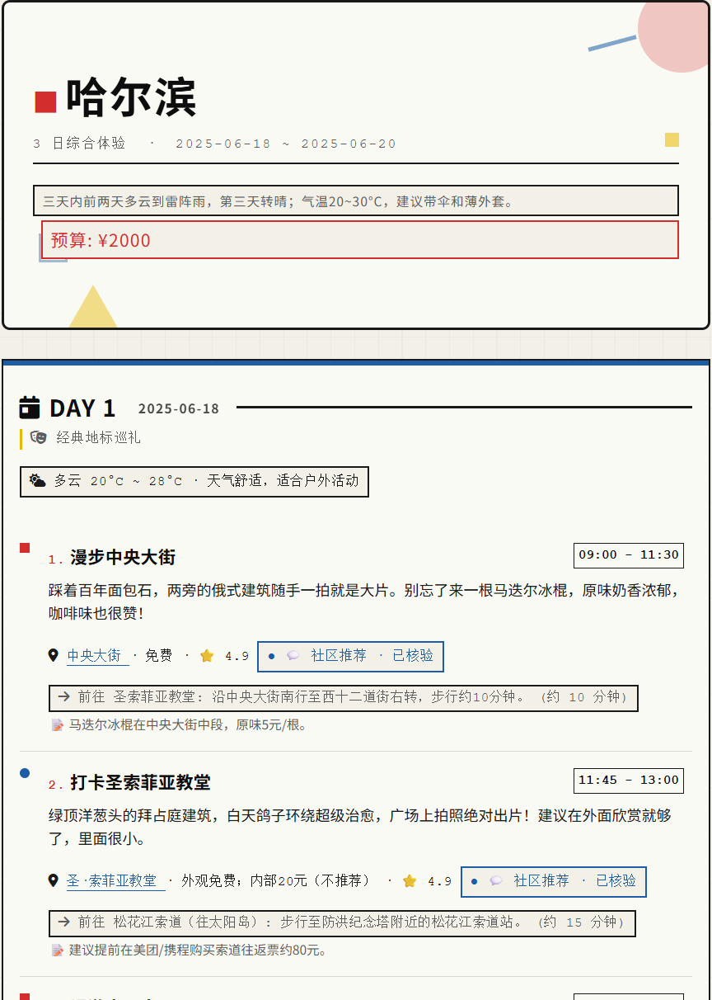
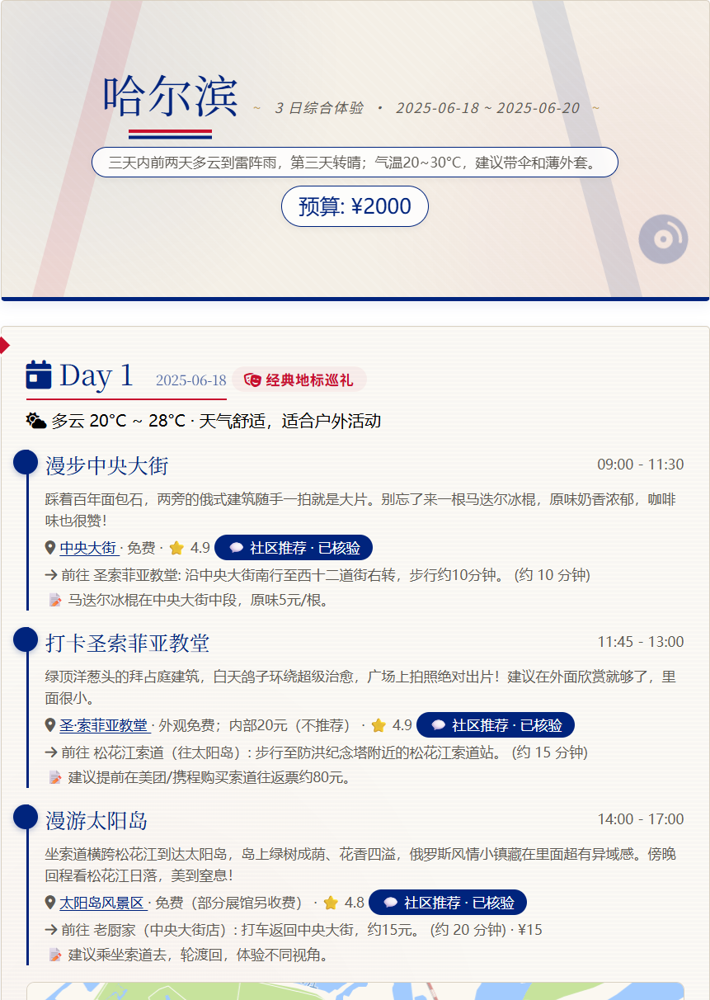
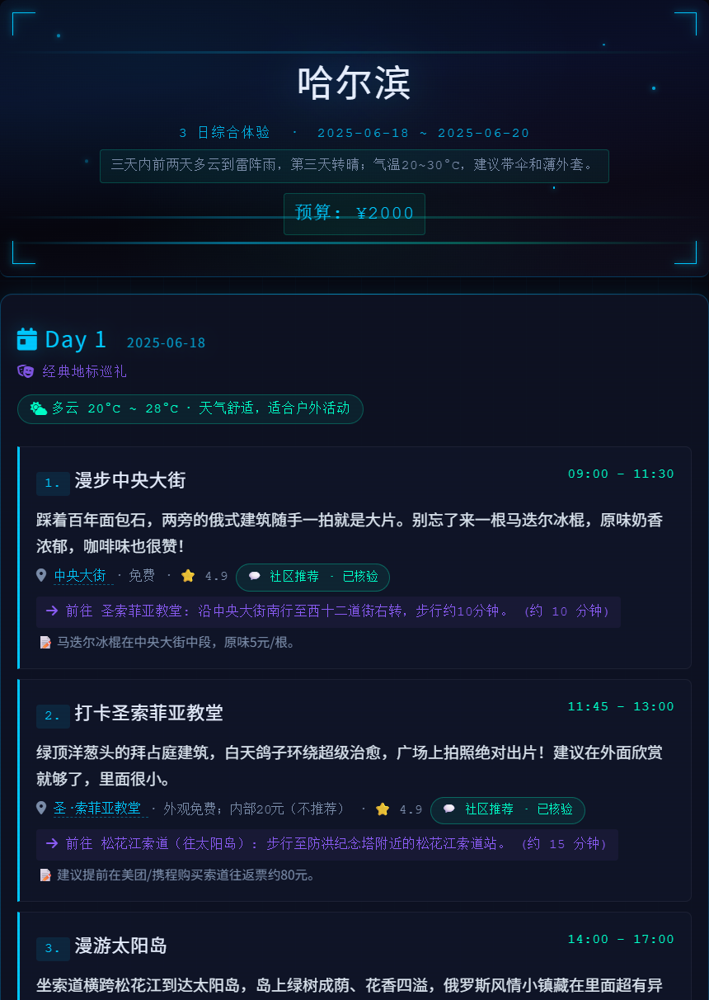
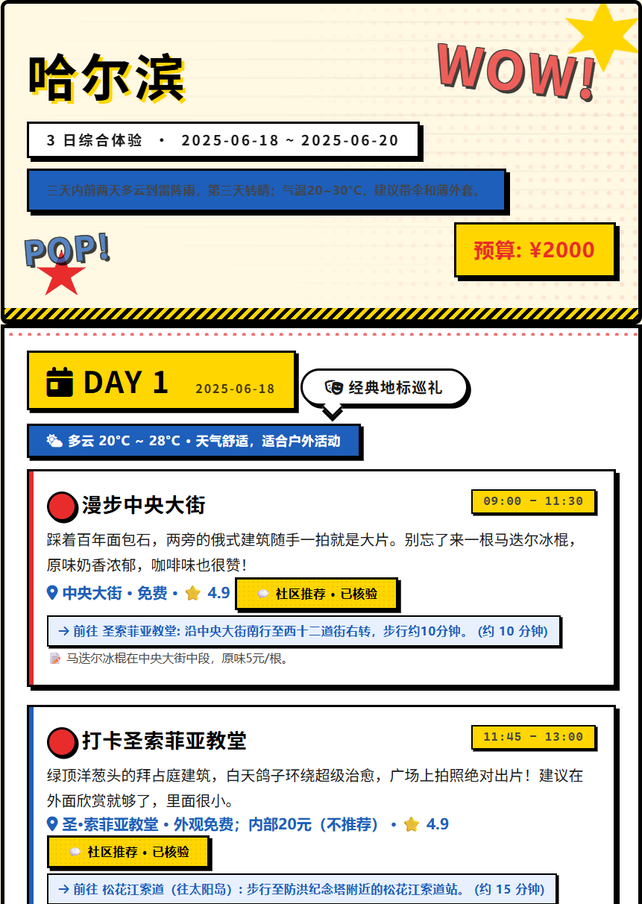

# Raven Agent

一个功能完整的 AI Agent 框架：

- **被动对话**：接入任何 OpenAI 兼容 LLM，在 Telegram 或 CLI 上和你聊天，支持工具调用。Telegram 端还支持语音识别和图片理解
- **长期记忆**：对话自动沉淀为结构化记忆，Markdown 文件 + 语义向量双引擎，中文友好
- **插件扩展**：几行 Python 就能注册新工具、挂载生命周期钩子
- **主动推送**：根据电量模型定时感知 RSS、健康数据等源信息，智能决策是否在 Telegram 上推送
- **内置旅行规划 Peer Agent**：对接高德地图和小红书，自动查天气、搜景点、比酒店、挖攻略，生成旅行手册，内置 29 种视觉风格的 HTML 模板
- **Web 控制台**：Dashboard 查看运行状态、对话历史

---

## 安装与配置

需要 Python 3.12+ 和 uv。

```bash
git clone https://github.com/hazewarm/raven-agent.git
cd raven-agent
uv sync
```

没有 uv？先 `pip install uv` 或者根据官网指南下载 [uv](https://docs.astral.sh/uv/)。

**1. 创建配置**

```bash
cp config.example.toml config.toml
```

然后编辑 `config.toml`，以下是各模块的配置说明：

**必填**

```toml
[llm]
provider = "deepseek"
model = "deepseek-v4-pro"
api_key = "sk-..."                       # 支持环境变量，如 "${DEEPSEEK_API_KEY}"
base_url = "https://api.deepseek.com"
max_tokens = 2048
streaming = true                          # 流式输出，仅 CLI 有效，Telegram 不支持
```

`provider` 随意填（仅用于日志标识），实际只依赖 `base_url`。你可以换成任何 OpenAI 兼容接口：OpenAI、Groq、硅基流动、Ollama 本地模型等，改为对应的 `model`、`base_url` 即可。

推荐使用 [DeepSeek](https://platform.deepseek.com/api_keys)，中文友好、价格便宜。

**Channels（通道配置）**

```toml
[channels]
socket = "/tmp/raven-agent.sock"          # CLI 客户端连接地址，Windows 填 127.0.0.1:8765
```

**Telegram（推荐开启）**

不配只能通过 CLI 对话，很多功能无法体验（如远程对话、主动推送）：

```toml
[channels.telegram]
enabled = true
token = "${TELEGRAM_BOT_TOKEN}"          # 支持环境变量
allow_from = ["your_username"]           # 用户名白名单，不填则所有人可与 telegram bot 对话
```

在 Telegram 里找 [@BotFather](https://t.me/BotFather) 发送 `/newbot` 即可创建 Bot 并获取 Token。

**Web 搜索工具**

不配 API Key 则 `web_search` 工具不可用，不影响其他功能：

```toml
[tools.web_search]
api_key = ""                             # SerpAPI Key
gl = "cn"                                # 搜索国家代码
hl = "zh-cn"                             # 搜索语言
```

基于 Google 搜索引擎，通过 [SerpAPI](https://serpapi.com/) 调用。注册后创建 Key，免费额度每月 100 次。

**语义记忆（Memory2）**

`[memory]` 单独开启即可使用 Markdown 文件记忆，不影响对话。向量检索需要额外开启 `[memory.embedding]`：

```toml
[memory]
enabled = true

[memory.embedding]
enabled = false                          # 设为 true 开启向量检索
provider = "openai-compatible"           # 仅用于日志标识
model = "text-embedding-v3"
api_key = ""                             # ← 开启后必须填，否则运行时 embedding 调用会报错
base_url = "https://dashscope.aliyuncs.com/compatible-mode/v1"
dimensions = 0                           # 输出向量维度，0 表示使用模型默认值
```

`enabled = false` 时会自动使用空实现，不报错但没有向量检索能力。设为 `true` 则必须配好 API Key。
模型和 `base_url` 可换成任何 OpenAI 兼容的 Embedding 接口，其他模型如 OpenAI 的 `text-embedding-3-small` 可能需要指定 `dimensions`（如 `1536`）。千问系列 Embedding 模型不需要设置 `dimensions`，会自动输出对应维度的向量。

推荐使用 [阿里云百炼](https://bailian.console.aliyun.com/) 的千问系列向量模型（如 `text-embedding-v3`），注册后免费额度 100 万 token，用完换一个模型即可。

**视觉识别（VL）**

如果 `[llm]` 配置的主模型本身是多模态模型（如 GPT-4o、Qwen-VL 等），将 `multimodal` 设为 `true` 即可，下面的 VL 配置不需要管。

如果主模型不支持图片（如 DeepSeek），设为 `false` 但不配 VL 也不会报错，只是 Agent 无法识别图片。如需识别，则需配置独立的 VL 模型。
`model` 和 `base_url` 可换成任何支持视觉的 OpenAI 兼容服务：

```toml
[vl]
multimodal = false
model = "qwen3-vl-flash"
api_key = ""                             # ← 需要时填
base_url = "https://dashscope.aliyuncs.com/compatible-mode/v1"
```

推荐使用 [阿里云百炼](https://bailian.console.aliyun.com/) 的千问 VL 系列，注册即送免费额度，用完也是换一个模型即可。

**语音识别（Audio）**

不配则 Agent 无法识别语音信息：

```toml
[audio]
enabled = false                          # 设为 true 开启语音转文字
model = "small"                          # Whisper 模型：tiny / base / small / medium / large-v3
```

首次使用会自动下载 Whisper 模型到本地，之后缓存复用。

| 模型 | 参数量 | 显存占用 | 相对速度 | 英文 WER | 多语言 WER |
|---|---|---|---|---|---|
| tiny | 39M | ~1GB | ~32x | 5.0% | 12.1% |
| base | 74M | ~1GB | ~16x | 3.4% | 8.4% |
| small | 244M | ~2GB | ~6x | 2.3% | 5.4% |
| medium | 769M | ~5GB | ~2x | 1.7% | 3.8% |
| large-v3 | 1550M | ~10GB | 1x | 1.4% | 3.0% |

推荐 `small`，精度和速度均衡。

**Agent**

```toml
[agent]
system_prompt = "You are Raven, a concise and helpful AI assistant."
subagent_model = ""                      # 后台子代理使用的模型，留空跟随主模型
```

`system_prompt` 不是完整的 system prompt，是开放给你自由发挥的自定义前缀。框架内部会自动追加当前时间、工具列表、记忆内容等，不需要你在此重复。

`subagent_model` 是后台子代理（`spawn` 工具创建的 SubAgent）使用的模型。留空跟主模型走，填了可指定其他模型。

**Peer Agent 委托**

将 `peer_agents.toml` 中定义的 Agent 包装为 `delegate_*` 工具，LLM 调用即可委托复杂任务。内置旅行规划 Agent：

```toml
[agent]
peer_enabled = true                      # 启用 Peer Agent 委托
peer_agents_toml = "peer_agents.toml"    # Peer Agent 注册表路径
```

Peer Agent 采用冷启动策略——第一次调用时才拉起子进程，任务完成后自动回收。添加新的 Agent 只需在 `peer_agents.toml` 里加一条配置。

**插件系统（Plugins）**

```toml
[plugins]
enabled = true
dirs = ["plugins"]                       # 用户插件目录，可多个

[plugins.builtins]
shell_safety = true                      # 拦截高风险 shell 命令
tool_loop_guard = true                   # 单轮工具调用数上限保护
context_pressure = true                  # 上下文过长时提示 Agent 摘要
status_commands = true                   # /status、/tokens 等状态命令
citation = true                          # 引用协议注入与清理
memory_rollup = true                     # 手动触发记忆整理
observe = true                           # 对话与工具调用日志记录
```

内置插件一般全开即可。你可以在 `plugins/` 目录下新建个人插件，启动时自动加载。

**定时任务（Scheduler）**

```toml
[scheduler]
enabled = true
timezone = "Asia/Shanghai"               # 时区，如 Asia/Shanghai、America/New_York
```

开启后 LLM 可用 `schedule` / `list_schedules` / `cancel_schedule` 工具创建定时任务。任务持久化存储，重启不丢失。

**外部工具（MCP）**

```toml
[mcp]
enabled = true
auto_connect = []                        # 启动时自动连接的 MCP server 名称列表
```

通过 Model Context Protocol 接入外部工具服务。初始不连接任何 MCP server，按需自行添加。Server 的具体配置（command、env、cwd、url）在 `.raven/mcp_servers.json` 中管理，详见 [`mcp_servers/README.md`](mcp_servers/README.md)。

**主动推送（Proactive）**

定时感知 MCP 数据源变化，LLM 决策是否在 Telegram 上推送。需要先配好 Telegram 和 MCP。初始不连接任何数据源，按需自行添加：

```toml
[proactive]
enabled = true
default_channel = "telegram"
default_chat_id = "用户名"               # 推送目标（Telegram 用户名或用户 ID）
```

推送频率由电量模型自动调节，也可自定义间隔和静默时段：

```toml
tick_interval_s3 = 420                  # base_score > 0.70 时 ~7 min
tick_interval_s2 = 1080                 # > 0.40 时 ~18 min
tick_interval_s1 = 2400                 # > 0.20 时 ~40 min
tick_interval_s0 = 4800                 # ≤ 0.20 时 ~80 min

quiet_hours_start = 22                  # 静默开始
quiet_hours_end = 8                     # 静默结束
quiet_hours_drift = true                # 静默时段可执行 drift 后台任务，false 则无视静默时段，正常推送
```

Drift 是"没东西推时找事干"的后台任务系统，在静默时段或无可推送信息时触发：

```toml
[proactive.drift]
enabled = true                           # true 开启 drift 功能，false 关闭
max_steps = 20                           # 单次 drift 最大工具调用轮数
min_interval_hours = 2                   # 两次 drift 最小间隔（小时）
```

**Dashboard**

```toml
[dashboard]
enabled = true
host = "0.0.0.0"
port = 2236
# api_key = "your-secret-key-here"      # 取消注释启用 API 认证
```

启动后在浏览器打开 `http://0.0.0.0:2236` 即可查看运行状态和对话历史。

**2. 其他可能需要修改内容**

**中文分词插件（libsimple）**

Python 自带的 SQLite 支持 FTS 全文检索，但原生不支持中文分词。Memory2 依赖开源项目 [sqlite-simple](https://github.com/wangfenjin/simple) 的 Jieba 分词扩展来实现中文语义检索。

项目自带了 Linux Ubuntu 22.04 版本的插件 `src/raven_agent/memory2/ext/*`。其他系统（Windows / macOS / 其他 Linux 发行版）请前往 [Releases](https://github.com/wangfenjin/simple/releases) 下载对应版本，替换 `src/raven_agent/memory2/ext/` 下的文件即可。

替换后运行 `uv run python check_jieba.py` 验证是否加载成功。

不替换不会报错，只是中文分词退化为 SQLite 内置的 trigram，语义检索的召回率会降低。目前没有适配 win_x86 系统的插件。

**旅行规划 Peer Agent**

如果想体验内置的旅行规划功能，还需配置 Peer Agent：

```bash
cp peerAgent/travel-planner/config.example.toml peerAgent/travel-planner/config.toml
```

然后编辑 `peerAgent/travel-planner/config.toml`：

```toml
[llm]
provider = "deepseek"
model = "deepseek-v4-pro"
api_key = ""                              # ← 必须填，LLM API Key
base_url = "https://api.deepseek.com"
max_tokens = 16384

[amap]
server_command = ["uvx", "amap-mcp-server"]
api_key = ""                              # ← 高德地图 Web API Key，必须填

[xhs]
server_command = ["stride28-search-mcp"]
search_mcp_home = "../../.raven/stride28-search"  # 小红书 Cookie 目录，获取方式见原项目

[trip_planner]
max_react_rounds = 50                     # ReAct 单步最大轮数
max_synthesis_retries = 3                 # JSON 校验失败最大重试次数
output_dir = "./outputs"
```

`[xhs]` 不配也不影响规划，只是无法获取小红书游记参考。`search_mcp_home` 目录需放置小红书 Cookie 文件。该 MCP 安装和使用方式参考 [Stride28-search-mcp](https://github.com/BrunonXU/Stride28-search-mcp) 项目说明。

**渲染插件配置**

Peer Agent 只产出 JSON，HTML 渲染由 `plugins/travel/` 插件完成。如需在网页中内嵌地图，还需配置高德地图 Key：

```bash
cp plugins/travel/_conf_schema.example.json plugins/travel/_conf_schema.json
```

编辑 `plugins/travel/_conf_schema.json`：

```json
{
    "amap_web_service_key": {
        "default": "",
        "description": "高德 Web 服务 Key（render_mode=static 时必需）"
    },
    "amap_js_key": {
        "default": "",
        "description": "高德 JS API Key（render_mode=dynamic 时使用）"
    },
    "amap_security_code": {
        "default": "",
        "description": "高德安全密钥/jscode（render_mode=dynamic 时使用，2021年12月后申请的 Key 必须配）"
    },
    "render_mode": {
        "default": "static",
        "description": "地图渲染模式：static 用静态地图 （离线可用），dynamic 用 JS API 交互地图（需 Dashboard 公网可达）"
    },
    "default_style": {
        "default": "art_deco",
        "description": "默认渲染风格 slug，LLM 未指定风格时使用"
    },
    "dashboard_base_url": {
        "default": "",
        "description": "Dashboard 公网可达 URL（render_mode=dynamic 时必须填，如 https://abc.ngrok-free.app）"
    }
}
```

- `render_mode = "static"`（默认）：只用静态地图，离线也能看，只需配 `amap_web_service_key`
- `render_mode = "dynamic"`：交互地图，需配 `amap_js_key` + `amap_security_code` + `dashboard_base_url`

不配也不影响 HTML 生成，只是网页中不会内嵌地图。

**3. 启动**

```bash
uv run python main.py serve
```

给 Telegram bot 发一条消息即可开始对话。也可以新建终端通过 CLI 客户端连接：

```bash
uv run python main.py cli
```

---

## 系统概览

Raven Agent 以 `serve` 模式运行，你通过 Telegram 或 CLI 客户端连上它。工作分两条线：

```
[被动回复] ──→ 你的消息 (Telegram / CLI)
                │
                ├── 记忆检索 ─── 每轮注入长期记忆 + 对话后 consolidation
                │
                ├── ReAct Agent Loop ─── LLM 推理 → 工具调用 → 结果回传 (可流式)
                │
                └── 插件系统 ─── 拦截命令、注册工具、注入上下文

[主动推送] ──→ 定期轮询 MCP 数据源
                │
                ├── LLM 逐条评分 ─── 值得推送 → 发 Telegram；不值得 → 跳过
                │
                ├── Drift ─── 没东西推时执行后台任务 (Scheduler 定时任务)
                │
                └── Peer Agent ─── 冷启动子进程 → A2A 委托复杂任务 (如旅行规划)
```

核心区别：**被动回复**等你发消息才干活，**主动推送**自己定时找事干。

<details>
<summary>内置工具一览（点击展开）</summary>

| 工具 | 说明 |
|---|---|
| `read_text_file` | 读取文本文件 |
| `list_directory` | 列出目录结构 |
| `write_text_file` | 写入文本文件 |
| `edit_file` | 精确字符串替换 |
| `read_image_info` | 查看图片元信息（尺寸、格式） |
| `web_fetch` | 抓取网页内容 |
| `web_search` | 互联网搜索 |
| `shell` | 执行 shell 命令（带安全检查） |
| `tool_search` | 按需发现延迟加载的工具 |
| `schedule` / `list_schedules` / `cancel_schedule` | 定时任务管理 |
| `message_push` | 跨通道推送消息 |
| `read_image_vision` | 视觉识别（需 VL API） |
| `transcribe_audio` | 语音转文字（需本地 Whisper） |
| `delegate_*` | Peer Agent 委托（旅行规划等） |

</details>

---

## 被动回复

收到消息 → 记忆检索 → ReAct 推理 → 工具调用 → 回复。每轮经过 7 个 Phase：BeforeTurn → BeforeReasoning → PromptRender → Reasoning → AfterReasoning → AfterTurn。

插件通过装饰器即可介入：`@tool` 注册新工具，`@on_turn_completed` / `@on_tool_pre` / `@on_tool_post` 等在生命周期的任意节点挂载逻辑。`plugins/hello/` 和 `plugins/dev_probe/` 有完整示例。

## 记忆系统

两套记忆互补工作：

- **Markdown 记忆** — MEMORY.md 全文注入 system prompt，通过 consolidation 自动从对话中提取结构化事实，Optimizer 定期归档 PENDING → MEMORY，中间隔一层保护 prompt cache。
- **Memory2（语义向量）** — SQLite + embedding 检索，支持 HyDE 查询增强、中文 Jieba 分词、用户画像提取。

## 定时任务（Scheduler）

LLM 可用 `schedule` / `list_schedules` / `cancel_schedule` 工具创建定时任务，任务持久化到 SQLite，重启不丢失。直接和 Agent 对话即可添加，例如：

```
"每天早上 9 点报一下今天杭州的天气"

"每周五下午 5 点提醒我备份数据库"

"1 小时后提醒我吃药"
```

Agent 会自动调用 `schedule` 工具创建任务，到点通过 Telegram 推送通知。

## 主动推送（Proactive）

Agent 根据电量模型自适应调整轮询频率。每轮拉取 MCP 数据源，LLM 逐条评分后决策是否推送。支持静默时段（深夜不扰）。

主动推送只支持 Telegram，CLI 是同步问答式终端。

## Peer Agent 委托

Peer Agent 是一个拥有自己 LLM 的独立 Agent（支持与主 Agent 使用不同的模型和配置）。它被包装成一个普通工具（如 `delegate_travel_planner`），主 Agent 的 LLM 调用它时只是提交任务，Peer Agent 内部用自己的 LLM 独立完成推理和工具调用，完成后系统自动通知你结果。冷启动、A2A 协议通信、后台轮询和结果回流等细节由框架自动处理。

内置了一个 **旅行规划 Peer Agent**——对接高德地图和小红书 MCP，自动查天气、搜景点、比酒店、挖攻略，最后生成结构化行程 JSON，还能渲染成 29 种风格的 HTML 旅行手册：

<p align="center">
  
  
  
  
  
</p>

例如在 Telegram 上发一句：

> "帮我生成哈尔滨三日游，日期在6.18-6.20，无特别主题要求"

Agent 会在后台自动调用 `delegate_travel_planner`，规划完成后返回 HTML 文件。

添加新的 Peer Agent 只需在 `peer_agents.toml` 里加一条配置。

---

## 扩展指南

想自己添加功能？以下是各模块的引导文档：

| 模块 | 说明 | 文档 |
|------|------|------|
| MCP | 接入外部工具服务，扩展 Agent 能力 | [`mcp_servers/README.md`](mcp_servers/README.md) |
| Plugin | 编写插件，注册工具、挂载生命周期钩子 | [`plugins/README.md`](plugins/README.md) |
| Skill | 编写对话场景指南，告诉 LLM 特定场景怎么处理 | [`skills/README.md`](skills/README.md) |
| Drift | 编写后台任务，让 Agent 空闲时自动执行 | [`drift/README.md`](drift/README.md) |
| Peer Agent | 创建独立的 Agent 子进程，委托复杂任务 | [`peerAgent/README.md`](peerAgent/README.md) |

---

## 其他命令

直接执行 `uv run python main.py` 会打印帮助信息，不做任何操作。

```bash
# 启动 Agent 服务（IPC + Telegram + Dashboard）
uv run python main.py serve

# CLI 客户端连接到运行中的服务
uv run python main.py cli          # 新建 session
uv run python main.py cli -c       # 继续最近一次 session
uv run python main.py cli -r       # 列出历史 session 手动选择
uv run python main.py cli --socket <IP>:<PORT>  # 连接远程 serve

# Web 控制台
uv run python main.py dashboard
uv run python main.py dashboard --host 0.0.0.0 --port 2236

# 全量数据库备份
uv run python main.py backup

# 运行测试代码
uv run pytest
uv run pytest tests/xxx.py -v
```

## 工作区

所有运行时数据保存在项目根目录的 `.raven/`。

---

## License

MIT
